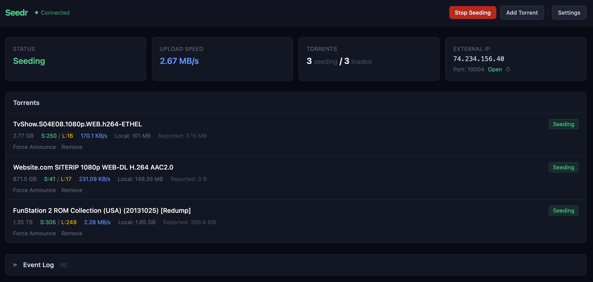

# Seedr


BitTorrent ratio master - emulates BT clients and reports simulated upload to private trackers.

Inspired by [JOAL](https://github.com/anthonyraymond/joal), built from scratch with TypeScript and Vue.js.



## How It Works

Seedr loads `.torrent` files, connects to their trackers, and announces simulated upload data - without actually downloading or uploading any content. It emulates real BitTorrent clients (qBittorrent, Deluge, Transmission, uTorrent, BitTorrent) by replicating their exact announce behavior: peer IDs, key generation, URL encoding, headers, and query parameter ordering.

**Key features:**
- 5 built-in client profiles with accurate protocol emulation
- HTTP and UDP (BEP-15) tracker support with automatic failover
- Bandwidth simulation with weighted distribution and jitter
- Real-time web dashboard with drag-and-drop torrent upload
- Port reachability checker via [check-host.net](https://check-host.net)
- Docker support with persistent data volume
- Configurable upload ratio targets, simultaneous seed limits, and more

## Is It Safe?

Yes. But just like anything in life, don't abuse it. Don't upload 1,000 torrents and set a 2 GB/s upload speed. Trackers can't distinguish traffic from Seedr vs. actual qBittorrent traffic, for example. But they can see that some idiot is uploading on torrents he never downloaded and at impossible speeds.

## Quick Start

### Docker (recommended)

```bash
docker compose up -d
```

The web UI is available at `http://localhost:8080`. Drop `.torrent` files into the `data/torrents/` directory or upload via the dashboard.

### Docker manual

```bash
docker run -d \
  --name seedr \
  -p 8080:8080 \
  -p 49152:49152 \
  -v ./data:/data \
  ghcr.io/rursache/seedr:latest
```

### Local development

Requires Node.js 22+.

```bash
# Install dependencies
npm install
cd ui && npm install && cd ..

# Start in development mode (hot reload)
npm run dev
```

The dev server starts the backend on port 8080 with hot reload. The frontend dev server proxies API requests to the backend.

### Production build

```bash
npm run build
npm start
```

## Port Forwarding

The BitTorrent port (default `49152`) is the port that trackers and peers use to verify your client is reachable. This is the port you need to forward on your router/firewall - not the web UI port. The web UI port (`8080`) should stay local and not be exposed to the internet.

## Configuration

All configuration is managed through the web UI Settings panel. Settings are persisted to `data/config.json`.

| Setting | Default | Description |
|---------|---------|-------------|
| Client Profile | qbittorrent-5.1.4 | Which BT client to emulate |
| Port | 49152 | Listening port announced to trackers (0 = random 49152-65534) |
| Min Upload Rate | 100 KB/s | Minimum simulated upload speed |
| Max Upload Rate | 500 KB/s | Maximum simulated upload speed |
| Simultaneous Seeds | -1 (all) | How many torrents to seed at once (-1 = unlimited) |
| Upload Ratio Target | -1 (unlimited) | Stop seeding after reaching this ratio (-1 = never stop) |
| Min Leechers | 0 | Only report upload when this many leechers are present |
| Keep With Zero Leechers | true | Keep seeding torrents that have no leechers |
| Skip If No Peers | true | Don't report upload if no peers are connected |

## Environment Variables

| Variable | Default | Description |
|----------|---------|-------------|
| `PUID` | `1000` | User ID to run as (for volume permissions) |
| `PGID` | `1000` | Group ID to run as (for volume permissions) |
| `SEEDR_DATA_DIR` | `data` | Root directory for config, state, torrents, and client profiles |
| `SEEDR_CLIENTS_DIR` | `$SEEDR_DATA_DIR/clients` | Directory containing `.client` profile files |
| `SEEDR_TORRENTS_DIR` | `$SEEDR_DATA_DIR/torrents` | Directory for `.torrent` files (watched for changes) |
| `WEB_PORT` | `8080` | Web UI and API port |
| `LOG_LEVEL` | `info` | Log level (debug, info, warn, error) |
| `SEEDR_USERNAME` | *(unset)* | Username for web UI authentication (optional) |
| `SEEDR_PASSWORD` | *(unset)* | Password for web UI authentication (optional) |

## Authentication

The web UI and API have **no authentication by default** - this is intentional since Seedr is designed to run locally or in Docker with only the BitTorrent port exposed to the internet.

To enable optional Basic Auth, set both `SEEDR_USERNAME` and `SEEDR_PASSWORD`:

```bash
# Docker Compose - uncomment the environment section in docker-compose.yml
environment:
  SEEDR_USERNAME: admin
  SEEDR_PASSWORD: changeme

# Docker manual
docker run -d --name seedr -p 8080:8080 -v ./data:/data \
  -e SEEDR_USERNAME=admin -e SEEDR_PASSWORD=changeme \
  ghcr.io/rursache/seedr:latest

# Local
SEEDR_USERNAME=admin SEEDR_PASSWORD=changeme npm start
```

When enabled, the browser will prompt for credentials when accessing the UI. All API endpoints and WebSocket connections are protected. If only one of the two variables is set, authentication remains disabled.

## Client Profiles

Seedr ships with several `.client` profile files that define how it emulates a specific BitTorrent client. Each profile controls peer ID format, key generation algorithm, URL encoding rules, HTTP headers, and query parameter ordering to match the real client's announce behavior.

Profiles are stored in the `data/clients/` directory and can be selected from the Settings panel. You can also add custom profiles by placing `.client` files in that directory.

## API

| Method | Endpoint | Description |
|--------|----------|-------------|
| `GET` | `/api/config` | Get current configuration |
| `PUT` | `/api/config` | Update configuration |
| `GET` | `/api/config/clients` | List available client profiles |
| `GET` | `/api/torrents` | List loaded torrents |
| `POST` | `/api/torrents` | Upload a .torrent file (multipart) |
| `DELETE` | `/api/torrents/:hash` | Remove a torrent |
| `POST` | `/api/torrents/:hash/announce` | Force an immediate announce |
| `POST` | `/api/control/start` | Start seeding |
| `POST` | `/api/control/stop` | Stop seeding |
| `GET` | `/api/control/status` | Get engine status |
| `GET` | `/api/control/port-check` | Check port reachability |

Real-time updates are available via Socket.IO on the same port.

## Tests

```bash
npm test              # Run once
npm run test:watch    # Watch mode
```

## License

MIT